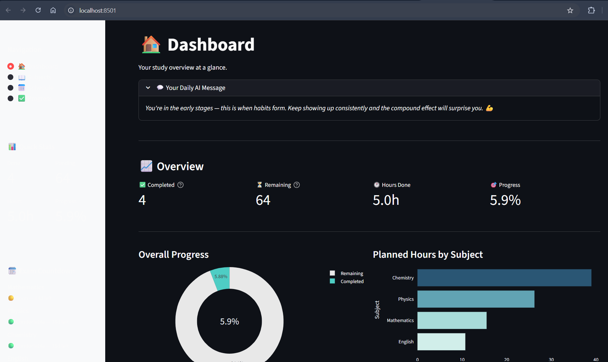
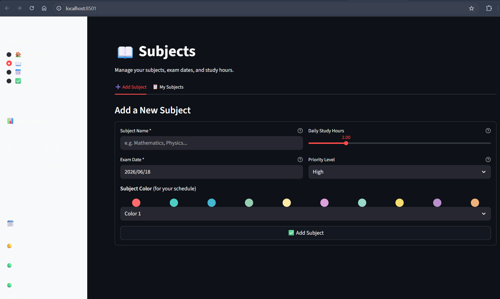
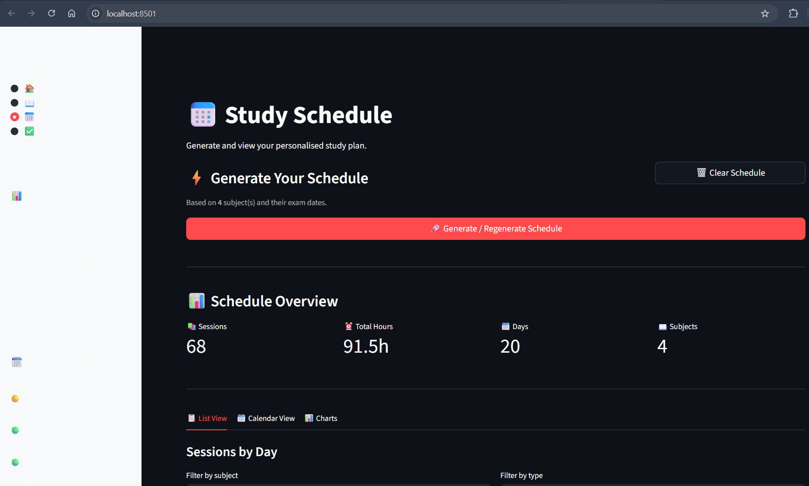
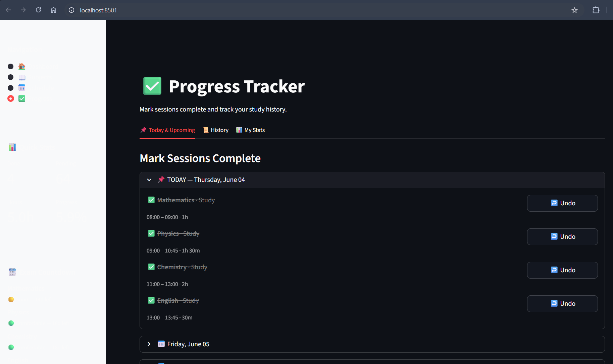

# 📚 AI Study Planner

A smart study planning application that helps students create personalised study schedules based on subjects, exam dates, priorities, and available study hours.

Built using **Python**, **Streamlit**, **Pandas**, and **Plotly**, this project demonstrates application development, data management, scheduling algorithms, progress tracking, and interactive analytics.

---

## ✨ Features

| Feature                          | Description                                                               |
| -------------------------------- | ------------------------------------------------------------------------- |
| 📖 Subject Management            | Add subjects with exam dates, study hours, priorities, and custom colours |
| 📅 Smart Scheduling              | Generate study schedules based on exam deadlines and priorities           |
| 🎯 Personalised Study Strategies | Receive tailored study recommendations for each subject                   |
| ✅ Progress Tracking              | Track completed study sessions and monitor consistency                    |
| 📊 Interactive Analytics         | Visualise progress with charts and performance metrics                    |
| 🏠 Dashboard Overview            | View upcoming exams, completion statistics, and study summaries           |
| 📝 Weekly Review                 | Get performance summaries and study recommendations                       |
| 💾 Persistent Storage            | Automatically save and load data using CSV files                          |

---

## 📸 Screenshots

### Dashboard



### Subject Management



### Study Schedule



### Progress Tracking



---

## 🚧 Challenges Faced

During development, several challenges were encountered:

- Managing persistent data storage using CSV files while maintaining data consistency.
- Handling different date formats when loading and saving subject information.
- Debugging issues where newly added subjects would overwrite previously stored subjects.
- Integrating and testing AI-powered study recommendations.
- Designing a modular architecture that separates UI components, business logic, and data management.
- Creating a study scheduling algorithm that balances exam urgency, priority levels, and available study time.

These challenges provided valuable experience in debugging, data handling, application architecture, and problem-solving.

---

## 🛠️ Tech Stack

* Python 3.10+
* Streamlit
* Pandas
* Plotly
* CSV Data Storage

---

## 📁 Project Structure

```text
ai-study-planner/
│
├── app.py
├── components/
├── core/
├── data/
├── utils/
├── assets/
├── screenshots/
├── requirements.txt
└── README.md
```

---

## 🚀 Installation

### Clone the repository

```bash
git clone https://github.com/anshulgopishetty/ai-study-planner.git
cd ai-study-planner
```

### Create a virtual environment (optional)

```bash
python -m venv venv

# Windows
venv\Scripts\activate

# macOS/Linux
source venv/bin/activate
```

### Install dependencies

```bash
pip install -r requirements.txt
```

### Run the application

```bash
streamlit run app.py
```

The application will open at:

```text
http://localhost:8501
```

---

## 📖 How to Use

### 1. Add Subjects

Add your subjects along with:

* Subject name
* Exam date
* Daily study hours
* Priority level

### 2. Generate Schedule

Navigate to the Schedule page and generate a personalised study plan.

### 3. Track Progress

Mark study sessions as completed and monitor your overall performance.

### 4. Review Analytics

Use the dashboard and progress pages to visualise productivity, study hours, and completion rates.

---

## 🧠 Key Concepts Demonstrated

* Python Application Development
* Data Persistence with CSV Files
* Scheduling Algorithms
* Data Analysis with Pandas
* Interactive Visualisations with Plotly
* Streamlit User Interface Development
* Modular Software Architecture
* Debugging and Problem Solving

---

## 🔮 Future Improvements

* PDF Export for Study Plans
* Calendar Integration
* User Authentication
* Database Support
* Mobile-Friendly Layout
* Advanced Study Analytics

---

## 👤 Author

Anshul Gopi Shetty

GitHub: https://github.com/anshulgopishetty

This project was built as part of my software development and AI portfolio.

---

## 📄 License

MIT License
